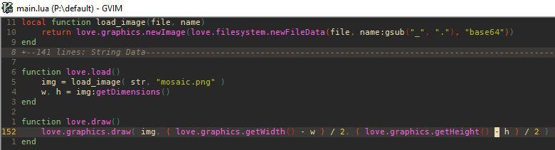

Vim LOVE Docs
###

Put the [`gen`](gen) directory inside `vimfiles\after` then run [`gen.bat`](gen/gen.bat) or [`gen.sh`](gen/gen.sh).

The file included should work fine until the next update of LOVE.

