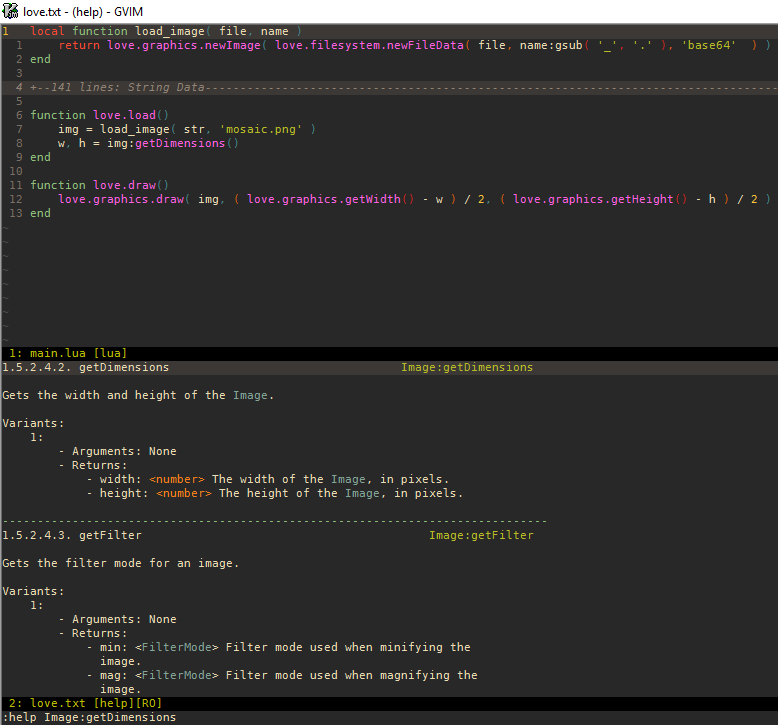
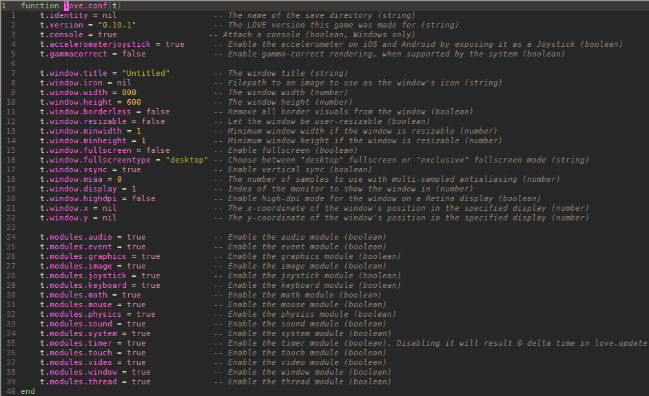
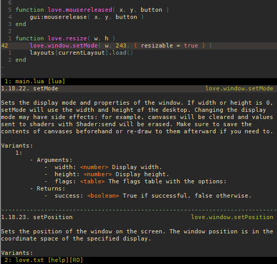

# Vim LOVE Docs

Vim syntax highlighting and helpfile for [LÖVE](http://love2d.org).

## Building the Plugin

The source can be installed from [vim.org](http://www.vim.org/scripts/script.php?script_id=5298), or can be built, from the source. If you wish to build it from source, follow the steps below:

1. Ensure that the following commands will run from the command line:

    - `git`
    - `lua`
    - `vim`

    You may also edit [`src/env.txt`](src/env.txt) to set custom values. For instance, if want to use Lua 5.2 instead of 5.3, you may change the line with `lua="lua"` to be `lua="lua5.2"` (assuming this command brings up the Lua 5.2 interpreter on your system).

1. Next, run [`gen.bat`](src/gen.bat) (Windows) or [`gen.sh`](src/gen.sh) (Mac/Linux). This should generate the plugin code.

You may need to allow the files to be able to run. You need to do this for **every** file that ends with `.bat` if you're on Windows, or `.sh` for Mac/Linux. Windows users will need to "Unblock" the `.bat` files. See [here](https://blogs.msdn.microsoft.com/delay/p/unblockingdownloadedfile/) for how to unblock files. For Mac/Linux users, you will need to `chmod` the `.sh` files to allow execution.

## Installing the Plugin

Installation varies depending on the plugin manager, but every method requires you to have the plugin built.

### Pathogen:

Move the directory containing the generated plugin code to `vimfiles\bundle` (Windows) or `~/.vim/bundle` (Mac/Linux).

### Vundle:

There are two ways you can install vim-love-docs with Vundle: either [fork the repo](#forking) or [install it on your system](#install-it-on-your-system).

#### Forking

To fork the repo, follow the instructions [here](https://help.github.com/articles/fork-a-repo/). After you've created a local clone of your fork, [build the plugin](#building-the-plugin) then commit those changes to *your* fork.

Then, you may use the plugin just as you use any other plugin with Vundle: `Plugin 'YOURUSERNAME/vim-love-docs'`

#### Install it on Your System

If you don't want to fork the repository, you can still use Vundle by calling `Plugin 'file:///path/to/plugin'`. See `:help vundle` for more.

### No manager:

Move the plugin code to their corresponding directory in `vimfiles\` (Windows) or `~/.vim/` (Mac/Linux). See [here](https://vi.stackexchange.com/questions/613) for methods of how to install a plugin without a plugin manager.

## Usage

This plugin is comprised of two parts: [syntax](#syntax) and the [help file](#help-file).

### Syntax

The syntax portion of the plugin highlights LÖVE functions, such as `love.udpate`, `love.graphics.rectangle`, and more. It also highlights `conf.lua` flags, such as `t.console`, `t.window.width`, etc.

The style of the syntax highlighting can be changed by setting `g:lovedocs_color` in your `.vimrc`. You can set the string to any valid highlighting specification (see `:help highlight-args`). By default, it is set to `g:lovedocs_color = 'guifg=#ff60e2 ctermfg=206'`.

### Help File

The plugin also includes help files for LÖVE, called `love.txt`. This file includes help for all of LÖVE's functions, as well as its types, enums, etc. It is generated from [love-api](https://github.com/love2d-community/love-api), so any discrepancies should be reported there.

The help file can be opened with `:help love.txt`, or by specifying a function, enum, or other identifier. The form for searching differs based on what is being searched, but each follows the same basic format: `:help love-SEARCH`.

#### Functions

Functions are found first by their full name. For instance, if you wanted to see the parameters for `love.window.setMode`, you could search `:help love-love.window.setMode`.

Each function features a brief description of what the function does, as well as the different forms of the function (called `Variants`) available. Each variant includes a function's return values and types (if any), as well as its parameters and their types (if any).

#### Types

Types are found by their name. For instance, if I wanted to look up the `File` type, I would do so with `:help love-File`. The documentation includes a brief description of what the type handles, as well as a list of constructors, supertypes, subtypes, and functions.

Type functions can also be found with the function name, using self-invocation syntax. For instance, if you wanted to read about the `File` function `isEOF`, you would search `:help love-File:isEOF`.

#### Enums

Searching for enums is similar to searching for types: just use the name. For instance, if you wanted to read about the `BufferMode` enum, you would search `:help love-BufferMode`.

Constants are separated by dashes. If you want to read about `BufferMode`'s constant `full`, you could search `:help love-BufferMode-full`.

## Screenshots

Plugins:

- [gruvbox](https://github.com/morhetz/gruvbox)
- [Rainbow](https://github.com/luochen1990/rainbow)
- [vim-love-docs](https://github.com/davisdude/vim-love-docs)

